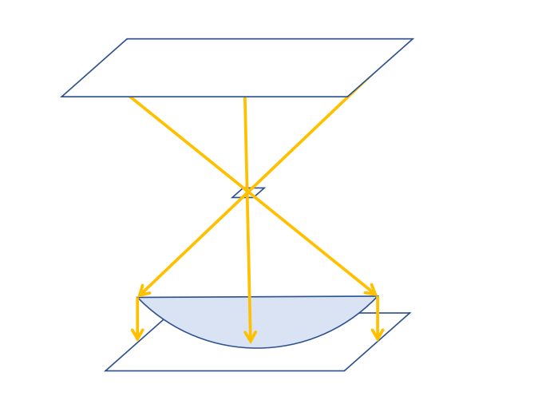

In the following text,

1. computer vision
2. communication,
3. movement
4. controller

these aspects will be described.

## Computer Vision

### Dataset prepare

We take 500 multiple object images and label them by hands. In order to avoid overfitting or underfitting problems, we have made requirements for the lighting of the environment, the background and the placement of objects:

1. Green floor images:

   1. Multiple instances on the same images.
   2. Simulate real environment.

2. Mutative background images:
   1. Keep lighting strength changing.
   2. Background changing.
   3. No two same image.

---

==@添加:==

_IabelImg_ [reference 0] is used to label all objects on each image. The labeled object is called instance. All instances are divided into training data, validation data and test data. In this experiment, 20% of instances are test, the rest 80% are training and valiation.

---

There are 530 bottle object labels, 450 battery object labels, 320 cup object labels, 480 orange object labels and 280 paper object labels. From the testing result, the box and classification curve has converged.

### Core computer vision algorithm Implementation

The CV framework is YOLOV5 [reference 1], which has the high performance in the low-power embedded devices. In the jetson nano, which has the 15 FPS (frames per second).

According to the data flow, we design the procedures are:

1. Base on the _YOLO V5_ gets all objects in one video frame. It will classify all objects on this frame and get the left upper pixel position and right lower pixel position for each object. We use the small model because of the embedded performance limitation.

   

   

2. The _position detector_ gets all depth of objects on one video frame. Base on the object pixel position on the frame, we use _realsense_ to get depth value of this object. Too little detected depth value will cause fluctuations, which lead unstable in this system. For performance considerations, we choose 13 points and get the depth value of them. These 13 points form a "X" shape in the rectangular which is the banding box of each objects. Then remove the outline values which is not in the $[ \mu - 3 \sigma, \mu + 3 \sigma]$ interval. Then get average value of rest of depth value as the final depth value of this object.

   

   ---

   ==@添加:==

   As the figure shown, there has a few detect point cannot get depth value or get the error value. Therefore, *Gaussian distribution* is used to filter error values. In the practice, hit rate of the detect points on instance is higher than shown figure. $\mu$ is *Mean* and $\sigma$ is *Standard deviation* of all detected values.

   ---

3. And all depth data pass the _depth comparator_ to get the nearest object as the primary object, which the cart will get next.

4. The _primary object detector_ gets the nearest object position. Base on the Carmera FOV (Field of View) and the resolution of camera, we can calculate the real position (x, y coordination and angle between head of cart and the object) in the 3D scenario. The x, y can be calculated by the below Python code.

   

   ```python
   # x_pixels is the horizontal piexl number of camera
   phi = math.atan2(n, x_pixels/2)
   # depth is the depth value between primary object and cart.
   x = depth * math.sin(phi)
   y = depth * math.cos(phi)
   ```

   ---

   ==@添加:==

   However, the light is imaged on the camera sensor through the lens is not a plane but a sphere. Therefore, the image will be caused a deformation, which is especially on the edge of image.  

   

   But in the practice, the deformation will not have a significant impact. Because the instance usually not at the edge of field of view.

   ---

5. Then take 20 results of _primary object detector_ pass the _primary objects filter_ to:

   1. remove the outline values,
   2. get average position,
   3. certain the class of object,

   This operation is used to avoid that any objects are not recognized in different frames, which can seriously affect the controller to make decisions.

6. Use the final result to generate movement commands. The commands will drive the 4 wheels to corresponding position.

## Communication

The communication between Jetson nano and Respberry Pi base on TCP (Transmission Control Protocol) network connection. We made a Ethernet directly connect them without any router or switch. Jetson nano sends the position of the primary object to Raspberry Pi. It has a pack operation in Jetson nano side and unpack operation in Respberry Pi side. 

---

==@添加:==

*JSON* is data format of transmission format. It can well cooperate with Python *dict*.  And much more information density than *XML*.

---

## Movement

According to the states:

1. last state, which include

   1. previous object class,
   2. previous cart position.

2. next object class.

The _movement controller_ will calculate the movement track and generate commands. Then Raspberry Pi writes the commands to serial port, send to wheel motor. After parsing the base-16 commands, the motor perform corresponding movement.

---

==@添加:==

```python
curr_position = 0
counter = 0

while (True):
    # Next instace class  
    clz = l.recevice()

    # All pick up postion for each class on cart
    next_gap = cfg["items"][str(clz)]
    # Position of cart should move
    gap = curr_position - next_gap
    # move to adjust gap
    move_gap[gap]()

    curr_position = next_gap
```

----

## Controller

It is used to coordinate the whole system run, load config file and control data flow.

---

==@添加:==

Furthermore, this module arrange all actions. All action are divided into 3 parts:

1. Departure,
2. Recognition, classification, Pick up(这里我不知道要用什么词比较好，我想说分拣).
3. Put in trash bin.

After this action complete, *Controller* performs next action.

---


---

==@添加:==

## Reference:

[reference0] IabelImg https://github.com/tzutalin/labelImg

[reference1] YoloV5 https://github.com/ultralytics/yolov5

---
